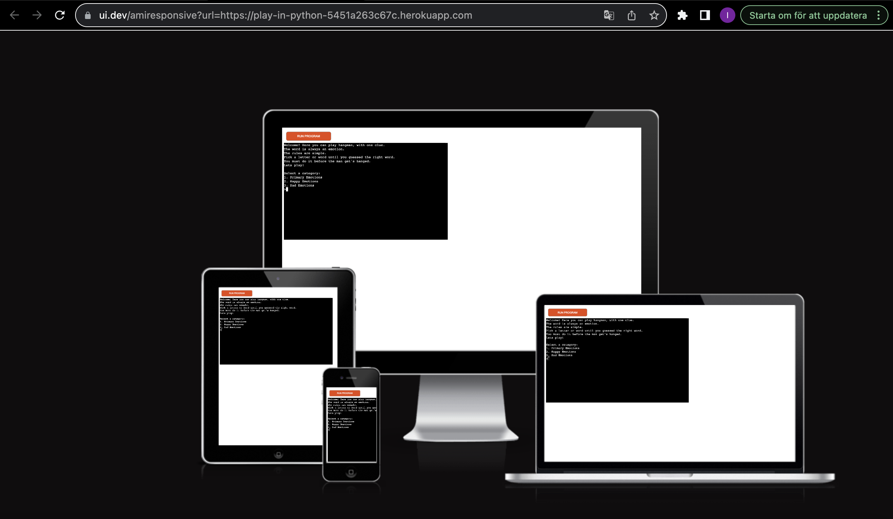
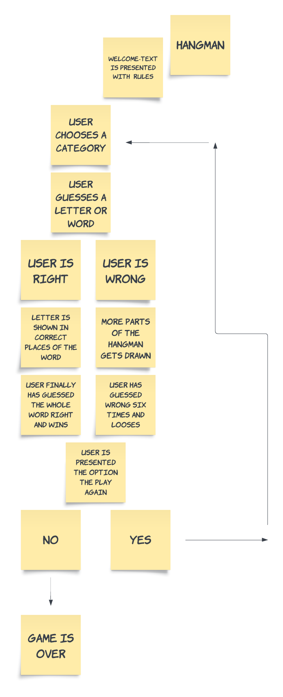

# [PLAY IN PYTHON](https://play-in-python-5451a263c67c.herokuapp.com)

Play in Python presents the option to play hangman with a theme. 
The theme is emotions.
My hope is that it will be a tool to explore and become more aware of emotions of others and self.
My target audience is mainly human beings on the autism spectrum.
It will be useful for these humans because it emotional understanding is usually not a granted knowledge for us. 

https://ui.dev/amiresponsive?url=https://play-in-python-5451a263c67c.herokuapp.com

## UX

My design-process started with a discussion with my mentor when I asked for advice and he shared a few links, 
after which I made a choice of creating a hangman-game which I enjoyed playing lågstadiet in school. 
I later on decided that I wanted it to have a theme. Learning and understanding emotions, which is a tricky thing.

## Features

In this section, you should go over the different parts of your project,
and describe each in a sentence or so.

You will need to explain what value each of the features provides for the user,
focusing on who this website is for, what it is that they want to achieve,
and how your project is the best way to help them achieve these things.

For some/all of your features, you may choose to reference the specific project files that implement them.

### Existing Features

- **Welcome**

    - Firstly when entering the game is a short welcome text, followed by the basic rules of the game.

- **Game**

    - When entering the game the option to choose a letter or word is presented. With this you can see the start of the pictured hangman.

- **Play again**

    - After winning or loosing, the option to play again is presented.

### Future Features

- Title for future feature #1
    - Any additional notes about this feature.

## Tools & Technologies Used

- [Python](https://www.python.org) used as the back-end programming language.
- [Git](https://git-scm.com) used for version control. (`git add`, `git commit`, `git push`)
- [GitHub](https://github.com) used for secure online code storage.
- [Gitpod](https://gitpod.io) used as a cloud-based IDE for development.
- [Heroku](https://www.heroku.com) used for hosting the deployed back-end site.

## Data Model

### Flowchart

To follow best practice, a flowchart was created for the app's logic,
and mapped out before coding began using a free version of
[Lucidchart](https://www.lucidchart.com/pages/ER-diagram-symbols-and-meaning).

Below is the flowchart of the main process of this Python program. It shows the entire cycle of the program.

### Classes & Functions

The primary functions used on this application are:

- `def clear()`
    - Clear function to clean-up the terminal so things don't get messy.
- `def get_word()`
    - Gets a word for the game.
- `def welcome()`
    - Welcome text for the user before the game starts.
- `def play(word)`
    - The actual interactive game. (Generates a word).
- `def choose_category()`
    - Gives the player an option to select a category.
- `def main()`
    -   Sews everything together, runs the game and repeats once completed.
- `main()`
    - Run all program functions.

### Imports

I've used the following Python packages and/or external imported packages.

- `os`: used for adding a `clear()` function
- `colorama`: used for including color in the terminal
- `random`: used to get a random choice from a list

## Testing

For all testing, please refer to the [TESTING.md](TESTING.md) file.

## Deployment

Code Institute has provided a [template](https://github.com/Code-Institute-Org/python-essentials-template) to display the terminal view of this backend application in a modern web browser.
This is to improve the accessibility of the project to others.

The live deployed application can be found deployed on [Heroku](https://play-in-python-5451a263c67c.herokuapp.com).

### Heroku Deployment

This project uses [Heroku](https://www.heroku.com), a platform as a service (PaaS) that enables developers to build, run, and operate applications entirely in the cloud.

Deployment steps are as follows, after account setup:

- Select **New** in the top-right corner of your Heroku Dashboard, and select **Create new app** from the dropdown menu.
- Your app name must be unique, and then choose a region closest to you (EU or USA), and finally, select **Create App**.
- From the new app **Settings**, click **Reveal Config Vars**, and set the value of KEY to `PORT`, and the value to `8000` then select *add*.
- Further down, to support dependencies, select **Add Buildpack**.
- The order of the buildpacks is important, select `Python` first, then `Node.js` second. (if they are not in this order, you can drag them to rearrange them)

Heroku needs two additional files in order to deploy properly.

- requirements.txt
- Procfile

You can install this project's **requirements** (where applicable) using:

- `pip3 install -r requirements.txt`

If you have your own packages that have been installed, then the requirements file needs updated using:

- `pip3 freeze --local > requirements.txt`

The **Procfile** can be created with the following command:

- `echo web: node index.js > Procfile`

For Heroku deployment, follow these steps to connect your own GitHub repository to the newly created app:

Either:

- Select **Automatic Deployment** from the Heroku app.

Or:

- In the Terminal/CLI, connect to Heroku using this command: `heroku login -i`
- Set the remote for Heroku: `heroku git:remote -a app_name` (replace *app_name* with your app name)
- After performing the standard Git `add`, `commit`, and `push` to GitHub, you can now type:
	- `git push heroku main`

The frontend terminal should now be connected and deployed to Heroku!

### Local Deployment

This project can be cloned or forked in order to make a local copy on your own system.

For either method, you will need to install any applicable packages found within the *requirements.txt* file.

- `pip3 install -r requirements.txt`.

#### Cloning

You can clone the repository by following these steps:

1. Go to the [GitHub repository](https://github.com/ilswh/play-in-python) 
2. Locate the Code button above the list of files and click it 
3. Select if you prefer to clone using HTTPS, SSH, or GitHub CLI and click the copy button to copy the URL to your clipboard
4. Open Git Bash or Terminal
5. Change the current working directory to the one where you want the cloned directory
6. In your IDE Terminal, type the following command to clone my repository:
	- `git clone https://github.com/ilswh/play-in-python.git`
7. Press Enter to create your local clone.

Alternatively, if using Gitpod, you can click below to create your own workspace using this repository.

Please note that in order to directly open the project in Gitpod, you need to have the browser extension installed.
A tutorial on how to do that can be found [here](https://www.gitpod.io/docs/configure/user-settings/browser-extension).

#### Forking

By forking the GitHub Repository, we make a copy of the original repository on our GitHub account to view and/or make changes without affecting the original owner's repository.
You can fork this repository by using the following steps:

1. Log in to GitHub and locate the [GitHub Repository](https://github.com/ilswh/play-in-python)
2. At the top of the Repository (not top of page) just above the "Settings" Button on the menu, locate the "Fork" Button.
3. Once clicked, you should now have a copy of the original repository in your own GitHub account!

### Local VS Deployment

Use this space to discuss any differences between the local version you've developed, and the live deployment site on Heroku.

## Credits

In this section you need to reference where you got your content, media, and extra help from.
It is common practice to use code from other repositories and tutorials,
however, it is important to be very specific about these sources to avoid plagiarism.

### Content

| Source | Location | Notes |
| --- | --- | --- |
| [Markdown Builder](https://tim.2bn.dev/markdown-builder) | README and TESTING | tool to help generate the Markdown files |
| [W3Schools](https://www.w3schools.com/howto/howto_js_topnav_responsive.asp) | entire site | Python |
| [YouTube](https://www.youtube.com/watch?v=u51Zjlnui4Y) | PP3 terminal | tutorial for adding color to the Python terminal |
| [strftime](https://strftime.org) | CRUD functionality | helpful tool to format date/time from string |
| [WhiteNoise](http://whitenoise.evans.io) | entire site | hosting static files on Heroku temporarily |

### Acknowledgements

- I would like to thank my Code Institute mentor, [Tim Nelson](https://github.com/TravelTimN) for their support throughout the development of this project.
- I would like to thank the [Code Institute Slack community](https://code-institute-room.slack.com) for the moral support; it kept me going during periods of self doubt and imposter syndrome.
- I would like to thank my family, for believing in me, and allowing me to make this transition into software development.
