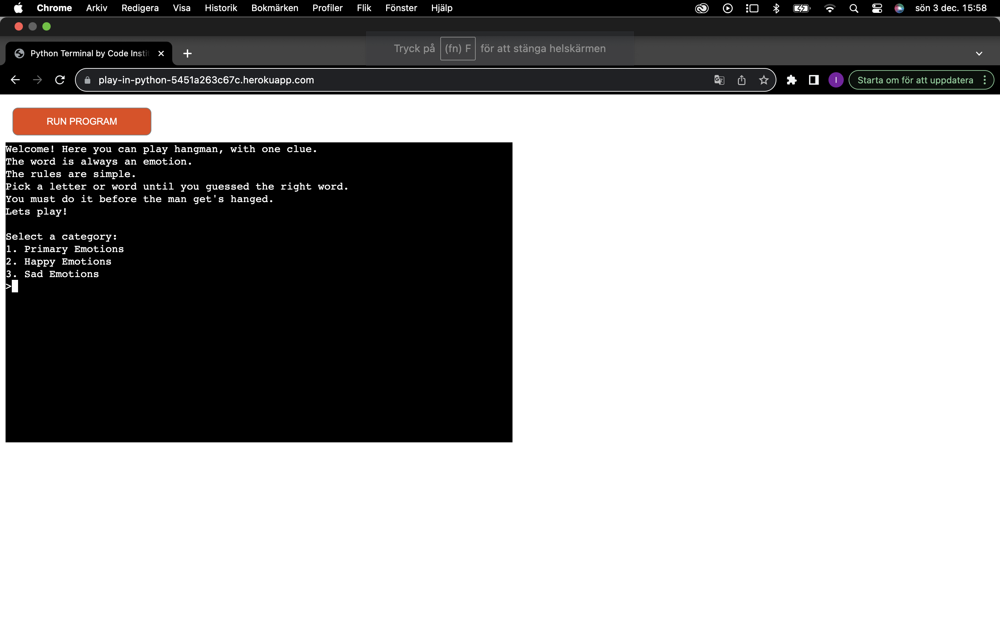
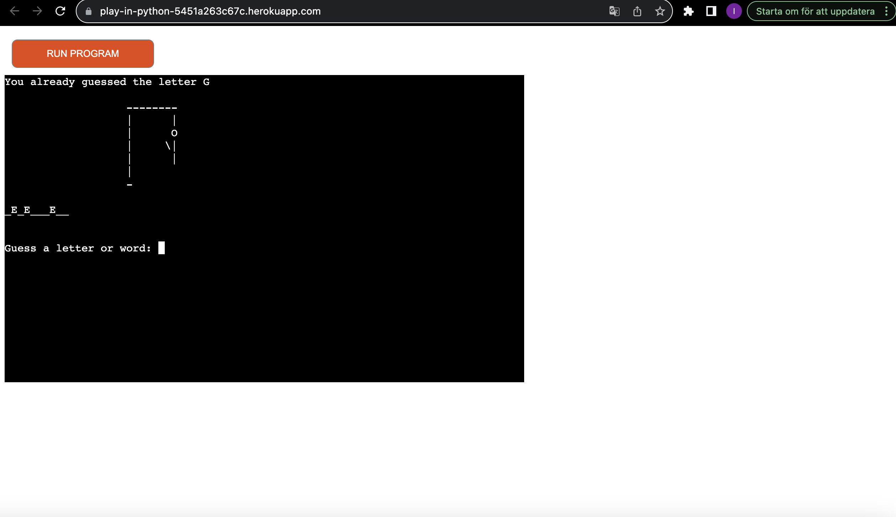

# Testing

Return back to the [README.md](README.md) file.

I have tested play-in-python through validation on PEP8 and browser compatability in chrome, firefox and opera. The defensive programming is also documented. 
Bugs that have appeared through the project is also documented here.
Everything works as intend it to.

## Code Validation

### Python

I have used the recommended [PEP8 CI Python Linter](https://pep8ci.herokuapp.com) to validate all of my Python files.

| File | CI URL | Screenshot |
| --- | --- | --- |
|play.py | [PEP8 CI](https://pep8ci.herokuapp.com/https://raw.githubusercontent.com/ilswh/play-in-python/main/play.py) |  |
| stages.py | [PEP8 CI](https://pep8ci.herokuapp.com/https://raw.githubusercontent.com/ilswh/play-in-python/main/checkout/stages.py) |  |
| primary_emotions.py | [PEP8 CI](https://pep8ci.herokuapp.com/https://raw.githubusercontent.com/ilswh/play-in-python/main/primary_emotions.py) |  |
| happy_emotions.py | [PEP8 CI](https://pep8ci.herokuapp.com/https://raw.githubusercontent.com/ilswh/play-in-python/main/happy_emotions.py) |  |
| sad_emotions.py | [PEP8 CI](https://pep8ci.herokuapp.com/https://raw.githubusercontent.com/ilswh/play-in-python/main/sad_emotions.py) |  |

## Browser Compatibility

I've tested my deployed project on following browsers to check for compatibility issues.

- [Chrome](https://www.google.com/chrome)
- [Firefox (Developer Edition)](https://www.mozilla.org/firefox/developer)
- [Opera](https://www.opera.com/download)

| Browser | Welcome | Game | Play again | Notes |
| --- | --- | --- | --- | --- |
| Chrome |  |  |  | Works as expected |
| Firefox |  |  |  | Works as expected |
| Opera |  |  |  | Works as expected |

## Responsiveness

I've tested my deployed project on the following devices to check for responsiveness issues.

- Tablet
- Desktop

| Device | Welcome | Game | Play again | Notes |
| --- | --- | --- | --- | --- |
| Tablet (DevTools) |  |  |  | Works as expected |
| Desktop |  |  |  | Works as expected |

## Lighthouse Audit

I've tested my deployed project using the Lighthouse Audit tool to check for any major issues.

| Mobile | Desktop | Notes |
| --- | --- | --- |
| ![screenshot] () |  |  | Works as expected |

## Defensive Programming

PP3 (Python-only):
- Users must enter a valid letter/word/string when prompted
- Users must choose from a specific list only

| Page | Expectation | Test | Result | Fix | Screenshot |
| --- | --- | --- | --- | --- | --- |
| Welcome | | | | | |
| | Feature is expected to go to choose the correct category when the user has entered a number between 1 and 3 | Tested the feature writing a number | The feature behaved as expected and chose a category within the game | Test concluded and passed |  |
| Game | | | | | |
| | Feature is expected to do add the guessed letter in correct places when user guess right | Tested the feature by typing the one of the right letters | The feature behaved as expected and places the letter in the right place | Test concluded and passed |  |
| | Feature is expected to add pieces of the hangman when the player guesses wrong letter | Tested the feature by guessing the wrong letter | The feature behaved as expected and added pieces of the hangman | Test concluded and passed |  |
| | Feature is expected to add pieces of the hangman when the player guesses an invalid character such as a number | Tested the feature by guessing a number | The feature behaved as and wrote, invalid guess | Test concluded and passed |  |
| | Feature is expected to add pieces of the hangman when the player guesses an invalid character such as a special character | Tested the feature by guessing a "?" | The feature behaved as expected and wrote, invalid guess | Test concluded and passed |  |
| | Feature is expected to say "you already guessed .." when a character is guessed more than once | Tested the feature by guessing g twice | The feature behaved as expected and wrote, "you already guessed the letter .." | Test concluded and passed |  |
| Play again | | | | | |
| | When the game is over, feature is expected to ask the player if they want to play again | Tested the feature by finishing a round of hangman | The feature behaved as expected, and gave me the option to play again after finishing a round | Test concluded and passed |  |
| | Feature is expected to take player to categories again after choosing yes | Tested the feature by entering y | The feature behaved as expected and gave me the option to choose a category after selecting yes | Test concluded and passed |  |
| | Feature is expected to take player to say "thanks for playing" again after choosing no | Tested the feature by entering n | The feature behaved as expected and said "thanks for playing" after typing n | Test concluded and passed |   |

## Bugs

- After adding new categories and typing them in global category, the game wouldn't open.

    

    - To fix this, I removed the underline & capitalized (named it by category instead of by filename).

- Line to long.

    

    - To fix this, I cut line in to two lines.

- Too many blank lines.

    

    - To fix this, I deleted one blank line.

- Trailing whitespace.

    

    - To fix this, I deleted whitespace.

- The option too choose a category appears when user choosies N (no) when site ask if user wants to play again.

    

    - To fix this, I deleted choose_category(172).

## Unfixed Bugs

There are no remaining bugs that I am aware of.
